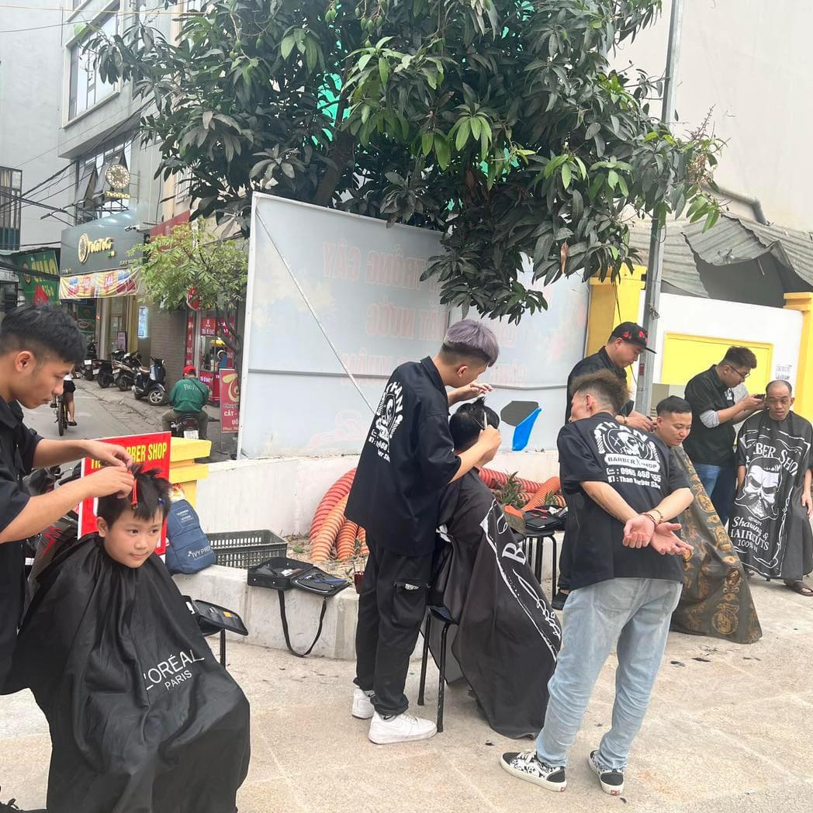
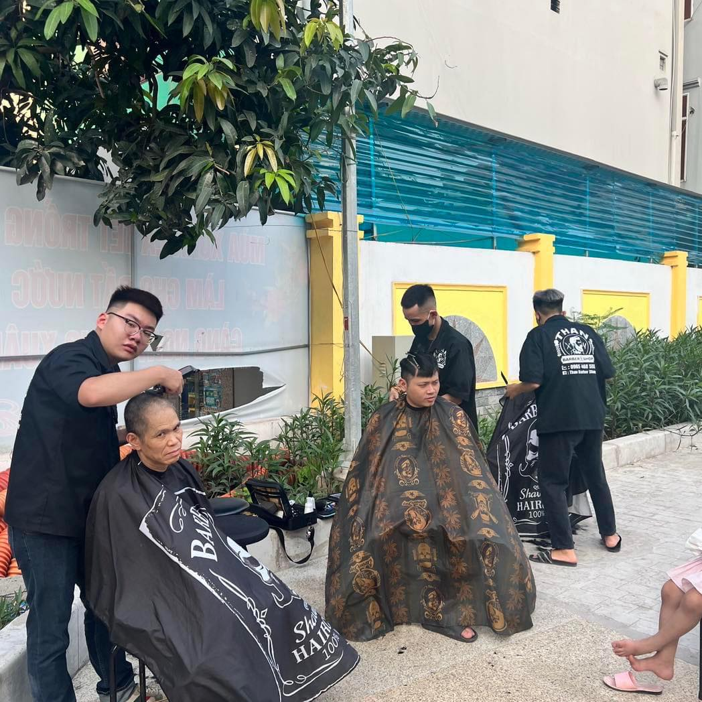
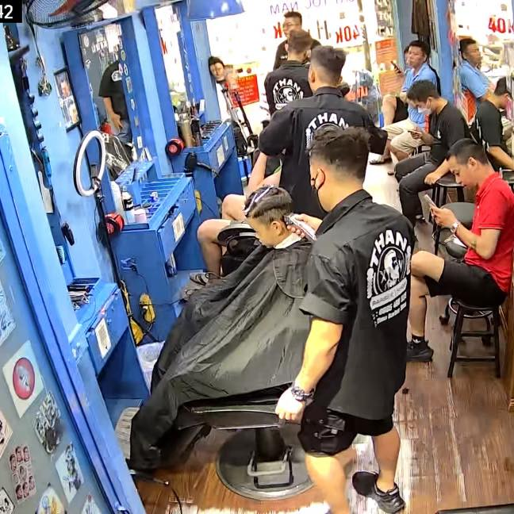
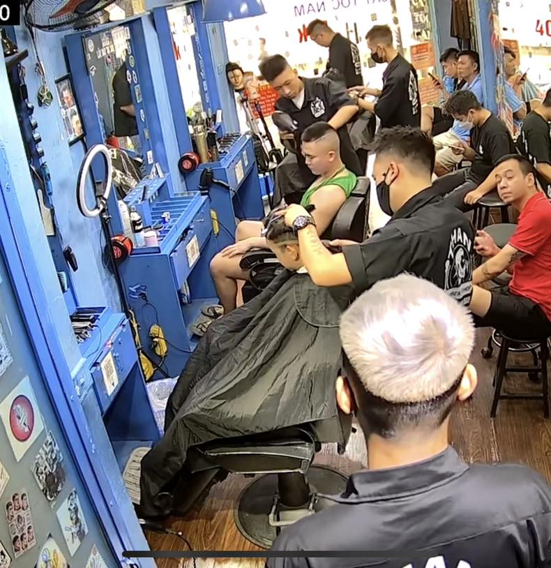
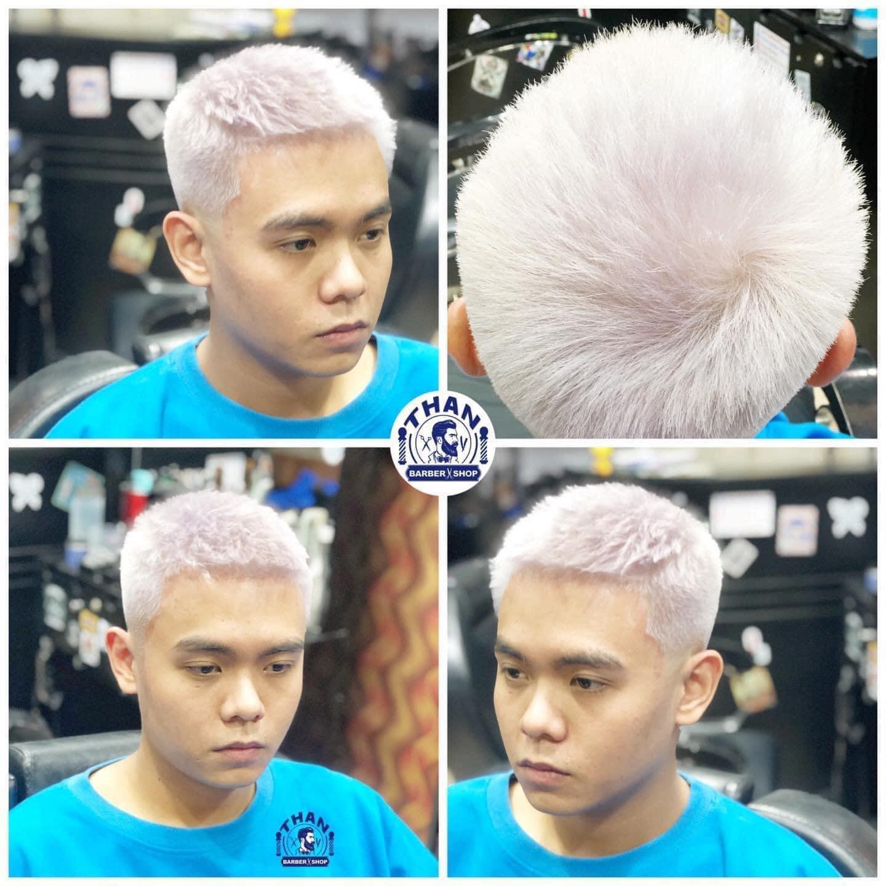
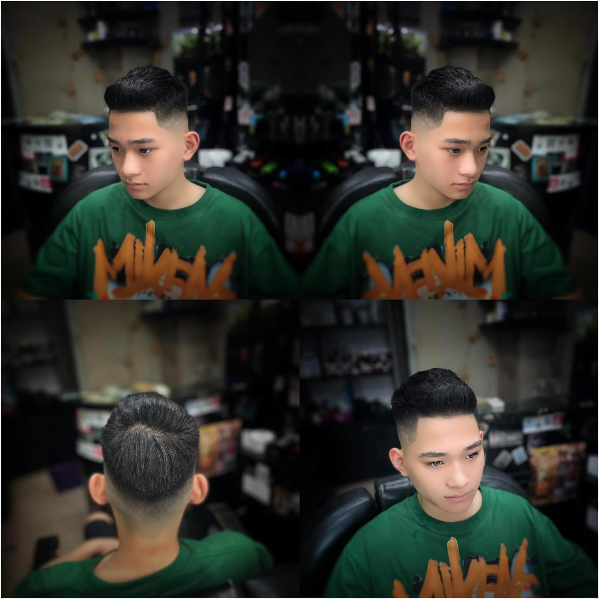
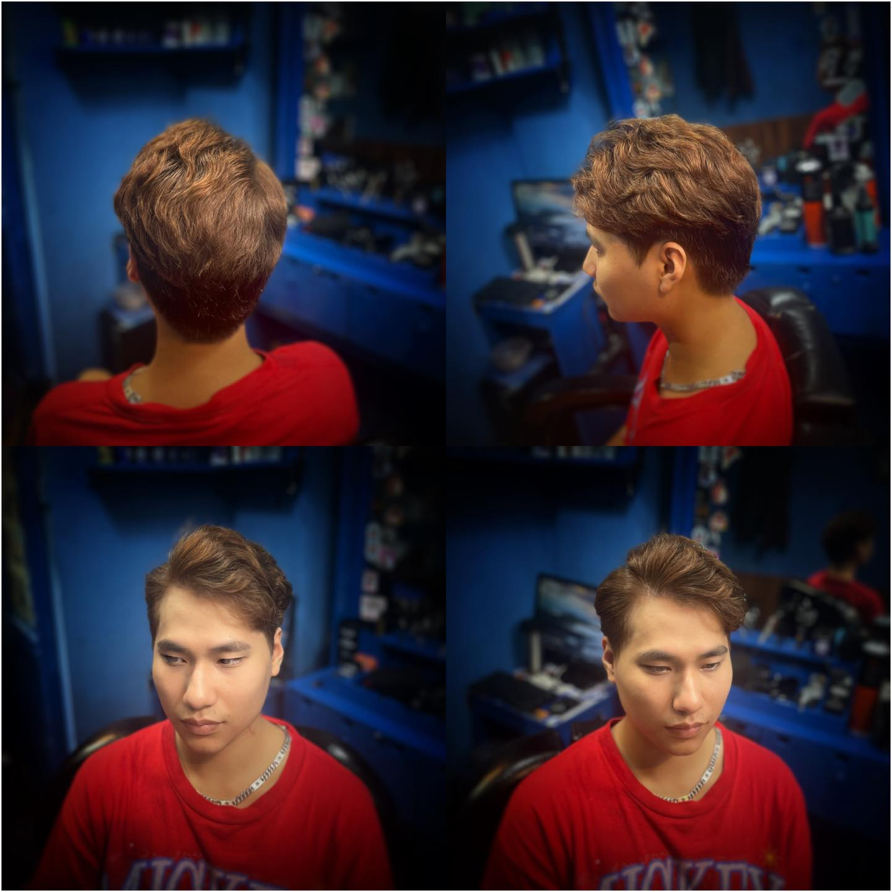
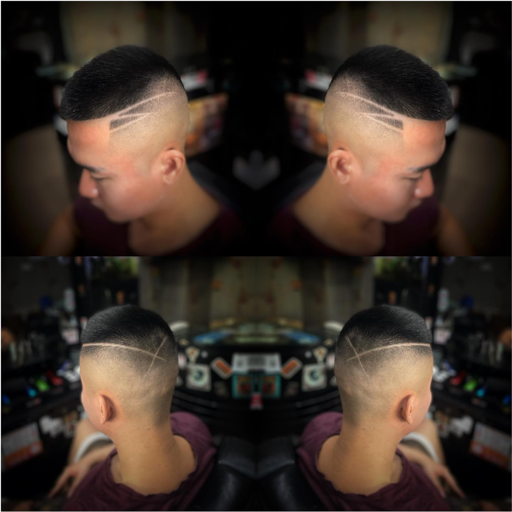
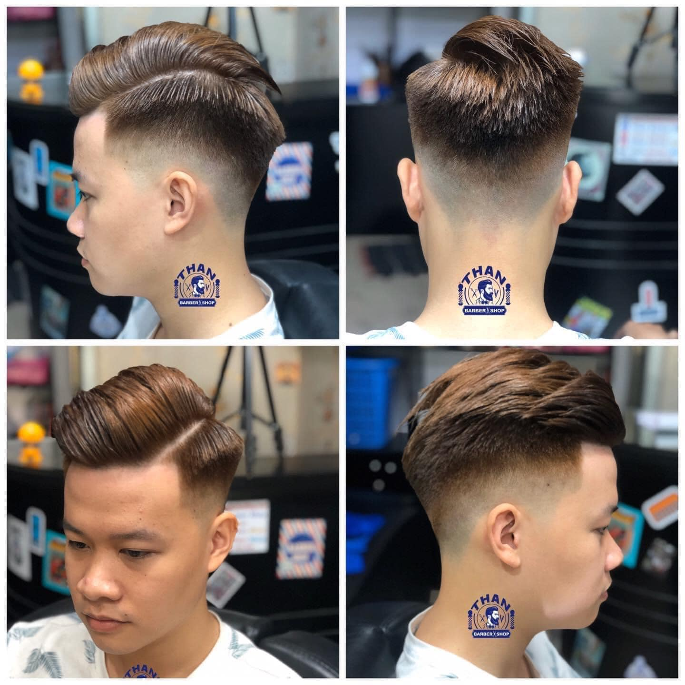
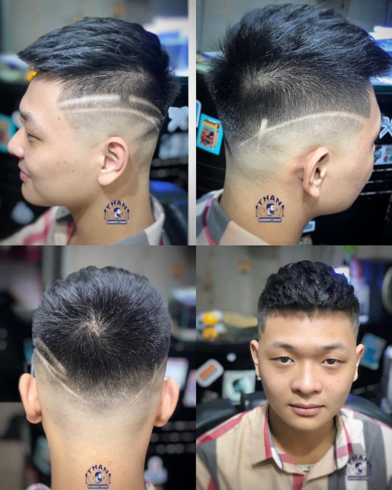

# Dạy Nghề Cắt Tóc Nam Đẹp Phong Cách Barber Tại Hà Nội - ThanBarberShop

Trong những năm gần đây, nghề barber đã trở thành một trong những ngành nghề hot nhất tại Việt Nam, đặc biệt là ở các thành phố lớn như Hà Nội. Với nhu cầu ngày càng cao về làm đẹp và phong cách của nam giới, việc sở hữu kỹ năng cắt tóc theo phong cách barber không chỉ mang lại cơ hội việc làm hấp dẫn mà còn giúp bạn khẳng định được tay nghề trong một lĩnh vực đầy sáng tạo. ThanBarberShop, một trong những tiệm cắt tóc nam hàng đầu tại Hà Nội, tự hào cung cấp khóa học dạy nghề [cắt tóc nam đẹp](https://thanbarbershop.com/dichvu/cat-toc-nam) phong cách barber chuyên nghiệp.

## 1. Tại Sao Nên Học Nghề Barber Tại ThanBarberShop?

### **Đội Ngũ Giảng Viên Chuyên Nghiệp**

ThanBarberShop sở hữu đội ngũ barber dày dặn kinh nghiệm, đã từng làm việc và học hỏi từ những chuyên gia hàng đầu trong ngành. Giảng viên tại đây không chỉ có kỹ năng cắt tóc điêu luyện mà còn am hiểu sâu sắc về xu hướng thời trang tóc nam hiện đại, sẵn sàng truyền đạt kiến thức và kinh nghiệm cho học viên.

### **Chương Trình Học Bài Bản, Đầy Đủ Kỹ Năng**

[Khóa học cắt tóc nam](https://thanbarbershop.com/day-nghe) phong cách barber tại ThanBarberShop được thiết kế chi tiết, bài bản, từ những kỹ thuật cơ bản nhất đến những phong cách cắt tóc phức tạp và hiện đại. Bạn sẽ được học tất cả các kỹ năng cần thiết để trở thành một barber chuyên nghiệp, bao gồm:

- **Kỹ thuật cắt cơ bản:** Cách sử dụng kéo, tông đơ và các dụng cụ chuyên dụng.
- **Tạo kiểu tóc:** Tạo hình và hoàn thiện các kiểu tóc nam phổ biến như Undercut, Pompadour, Faux Hawk, Mohican, v.v.
- **Kỹ thuật fade:** Tạo độ mờ và chuyển tiếp mượt mà giữa các lớp tóc.
- **Tư vấn phong cách:** Hướng dẫn cách tư vấn kiểu tóc phù hợp với từng khuôn mặt và phong cách cá nhân của khách hàng.

### **Thực Hành Trực Tiếp Trên Mẫu Thật**

ThanBarberShop luôn chú trọng vào việc thực hành, đảm bảo học viên có thể áp dụng ngay những gì đã học vào thực tế. Tại đây, bạn sẽ có cơ hội thực hành cắt tóc trên mẫu thật dưới sự hướng dẫn tận tình của các giảng viên, giúp bạn nhanh chóng nâng cao tay nghề và tự tin hơn khi bước vào nghề.

### **Chứng Chỉ Hành Nghề Uy Tín**

Sau khi hoàn thành khóa học, bạn sẽ được cấp chứng chỉ hành nghề uy tín từ ThanBarberShop, mở ra nhiều cơ hội việc làm trong ngành làm đẹp. Đây là tấm vé thông hành giúp bạn dễ dàng xin việc tại các salon tóc, barbershop hoặc thậm chí mở tiệm riêng cho mình.

## 2. Cơ Hội Nghề Nghiệp Sau Khóa Học

Nghề barber không chỉ mang lại thu nhập ổn định mà còn mở ra nhiều cơ hội phát triển nghề nghiệp. Sau khi hoàn thành khóa học tại ThanBarberShop, bạn có thể lựa chọn làm việc tại các barbershop nổi tiếng, trở thành thợ cắt tóc tự do, hoặc tự mở tiệm barber của riêng mình.

Với nhu cầu ngày càng cao về dịch vụ cắt tóc nam, đặc biệt là phong cách barber, nghề này hứa hẹn sẽ tiếp tục phát triển mạnh mẽ trong tương lai. Học nghề tại ThanBarberShop sẽ trang bị cho bạn đầy đủ kỹ năng và kiến thức để thành công trong ngành này.

## 3. Thông Tin Liên Hệ Và Đăng Ký Khóa Học

Nếu bạn đam mê nghệ thuật cắt tóc và muốn theo đuổi sự nghiệp trong lĩnh vực này, đừng ngần ngại liên hệ với ThanBarberShop để biết thêm thông tin chi tiết về khóa học.

- **Địa chỉ:** 152 Phố Chùa Quỳnh - Phường Quỳnh Lôi - Quận Hai Bà Trưng - Tp Hà Nội
- **Số điện thoại:** 0965.468.555
- **Email:** thanbarbershop@gmail.com
- **Website:** [thanbarbershop.com](https://thanbarbershop.com)
- **Facebook:** [fb.com/thanbarbershop](https://facebook.com/thanbarbershop)

ThanBarberShop luôn sẵn sàng đón nhận những học viên có đam mê và mong muốn phát triển trong lĩnh vực cắt tóc nam. Hãy đến với chúng tôi và bắt đầu hành trình trở thành một barber chuyên nghiệp ngay hôm nay!

**ThanBarberShop - Nơi Đào Tạo Barber Chuyên Nghiệp Tại Hà Nội.**

